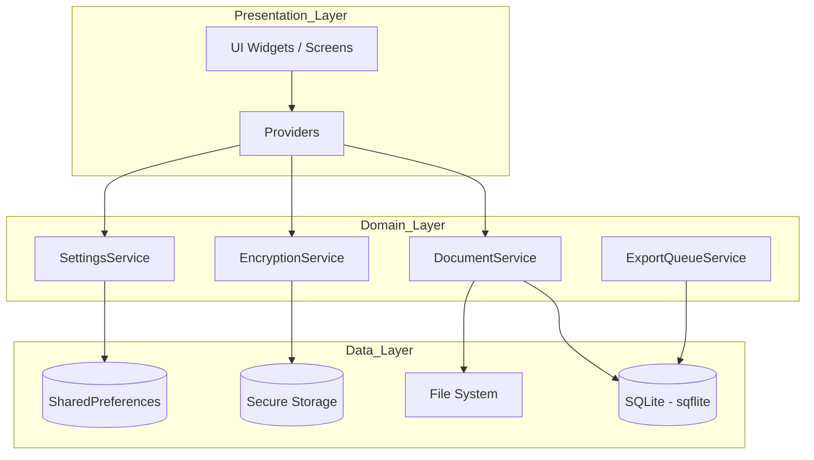

# 01 Architecture - PasswordPDF

## Table of Contents
1. [Architecture Pattern](#architecture-pattern)
2. [Layer Breakdown](#layer-breakdown)
3. [Dependency Injection](#dependency-injection)
4. [Routing & Navigation Strategy](#routing--navigation-strategy)
5. [Architecture Diagram](#architecture-diagram)

---

## Architecture Pattern
PasswordPDF follows a **Layered Architecture** with **Provider** for state management and **Service-based Business Logic**. It is organized into feature-first modules to ensure scalability and maintainability.

### The "Zero Copy" Architecture
A core architectural decision is the **Zero Copy** approach for file management. Instead of duplicating imported PDF files into the app's internal storage, the app stores a **reference (absolute path)** to the file in its SQLite database. This saves storage space and allows the app to detect if files are moved or deleted externally.

## Layer Breakdown

### 1. Presentation Layer (`/lib/features/*/screens`)
- **Widgets & Screens**: Responsible for rendering the UI.
- **Providers**: Manage local UI state and bridge the gap between UI and Services.
- **Logic**: Minimal UI logic; complex operations are delegated to Services.

### 2. Domain/Logic Layer (`/lib/services`)
- **Services**: Contain the core business rules (e.g., `DocumentService` handles folder indexing, `EncryptionService` handles password security).
- **Repositories**: In this app, Services often act as repositories, interfacing directly with local storage.

### 3. Data Layer (`/lib/models` & `/lib/services/storage_service.dart`)
- **Models**: Plain Dart objects with JSON serialization (`DocumentItem`, `PasswordModel`).
- **SQLite**: Managed via `StorageService` using the `sqflite` package.
- **KeyValue**: `SharedPreferences` for simple settings.
- **Secure Storage**: `FlutterSecureStorage` for the master PIN.

## Dependency Injection
The app uses **MultiProvider** in `main.dart` to inject singletons and shared services globally:
- `SettingsService`: App-wide preferences.
- `ExportQueueService`: Background task management.
- `EncryptionService`: Security utilities.
- `DocumentService`: File and folder management.
- `UpdateService`: Version management.

## Routing & Navigation Strategy
- **Base Navigator**: Uses a `GlobalKey<NavigatorState>` located in `main.dart`.
- **Main Entry**: `AppEntry` handles authentication (Biometric/PIN) before showing the `MainScreen`.
- **Tabbed Navigation**: `MainScreen` uses `IndexedStack` with a `NavigationBar` for persistent state across tabs (All Docs, Documents, Settings).
- **Direct Navigation**: standard `Navigator.push` for deep screens like `PdfViewerScreen` or `FileInfoScreen`.

## Architecture Diagram

