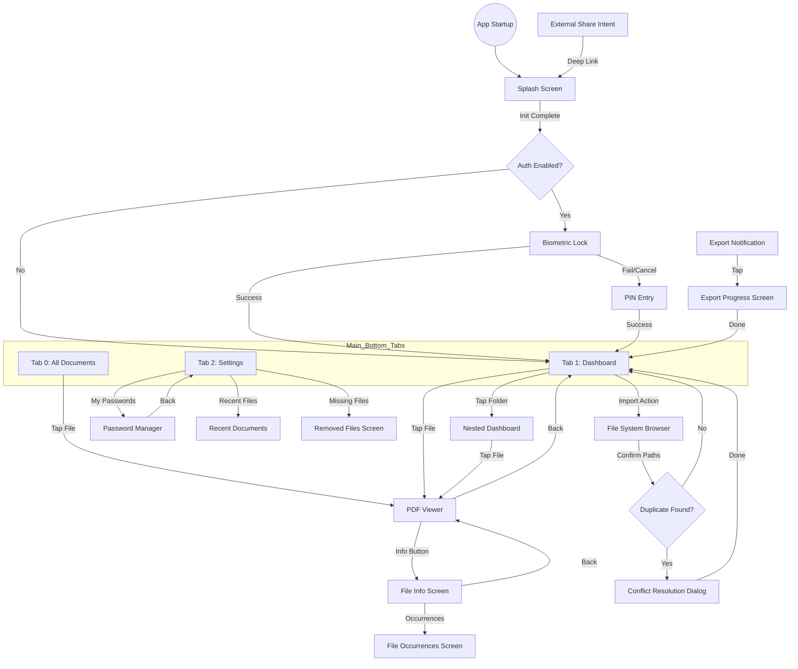

# 02 Screens & Navigation - PasswordPDF

## Table of Contents
1. [Screen Registry](#screen-registry)
2. [Detailed Screen Analysis](#detailed-screen-analysis)
3. [Navigation Flow Diagram](#navigation-flow-diagram)

---

## Screen Registry

| Name | File Path | Route / Access | Purpose |
|------|-----------|----------------|---------|
| **Splash Screen** | `lib/features/authentication/widgets/animated_splash_logo.dart` | Startup in `AppEntry` | Initial pulse animation and initialization gate. |
| **Biometric Lock** | `lib/features/authentication/screens/biometric_lock_screen.dart` | Auth gate or App Resume | Hardware-level biometric authentication. |
| **PIN Entry Screen** | `lib/features/authentication/screens/pin_entry_screen.dart` | Auth fallback or Primary Auth | Secure PIN-based authentication. |
| **All Documents** | `lib/features/documents/screens/all_documents_screen.dart` | Main Screen - Tab 0 | Device-wide PDF scanner and browser. |
| **Document Dashboard**| `lib/features/documents/screens/document_dashboard_screen.dart` | Main Screen - Tab 1 | Virtual folder and app-managed library. |
| **PDF Viewer** | `lib/features/documents/screens/pdf_viewer_screen.dart` | From File Tap | Core PDF rendering and interaction engine. |
| **File Info** | `lib/features/documents/screens/file_info_screen.dart` | Viewer Info / Dashboard Menu | Detailed metadata and file occurrence tracking. |
| **Settings** | `lib/features/settings/screens/settings_screen.dart` | Main Screen - Tab 2 | App configuration and utility access. |
| **Password Manager** | `lib/features/password_manager/screens/password_manager_screen.dart` | Settings -> My Passwords | Secure vault for PDF passwords. |
| **Export Progress** | `lib/features/documents/screens/export_progress_screen.dart` | Notification Tap | Live monitoring of ZIP export tasks. |
| **File system Browser**| `lib/features/documents/screens/file_system_browser.dart` | Dashboard -> Import | Native file picker and bulk importer. |
| **Recent Documents** | `lib/features/recent_documents/screens/recent_documents_screen.dart` | Settings -> Recent Files | History of recently opened documents. |
| **Removed Files** | `lib/features/documents/screens/removed_files_screen.dart` | Settings -> Missing Files| Management for deleted/moved files references. |

---

## Detailed Screen Analysis

### ### Screen 1: Splash Screen
**File Path**: `lib/features/authentication/widgets/animated_splash_logo.dart`  
**Access / Route**: Triggered immediately upon app launch via `AppEntry`.  
**Purpose**: Provides a professional entry point while the app checks for authentication settings and initializes services. It visualizes the branding with a heartbeat pulse effect.  
**UI Elements**: Centralized app logo, animated tagline text, pulse animation.  
**Parameters Accepted**: `animateText` (bool) - controls whether the tagline text performs its entry animation.  
**State Management**: Orchestrated by `AppEntry` logic; does not have a dedicated Provider.  
**Key Logic**: The screen is shown for a fixed duration (or until auth check completes). It signals `AppEntry` to transition to either the Auth gate or `MainScreen`.  
**Navigation Out**: Navigates to `BiometricLockScreen` (if auth enabled) or `MainScreen` (if auth disabled).  
**Edge Cases**: If initialization fails, the app might stay on this screen or show a global error dialog.

### ### Screen 2: Biometric Lock Screen
**File Path**: `lib/features/authentication/screens/biometric_lock_screen.dart`  
**Access / Route**: Pushed by `AppEntry` on startup or by `WidgetsBindingObserver` if the app resumes from the background after a timeout.  
**Purpose**: Acts as a security barrier requiring Fingerprint or FaceID to access the app data.  
**UI Elements**: App logo, "Unlock with Biometrics" button icon, "Use PIN instead" text button, locked status indicator.  
**Parameters Accepted**: `onAuthenticated` (VoidCallback) - triggered upon successful auth.  
**State Management**: `BiometricService` (uses `local_auth` package).  
**Key Logic**: Tracks `backgroundTime` using `WidgetsBindingObserver`. If the time difference exceeds `autoLockTimeout` (default 10 minutes), the screen is forced.  
**Navigation Out**: Transition to `MainScreen` on success; navigates to `PinEntryScreen` if biometrics are cancelled or failed multiple times.  
**Edge Cases**: Hardware not available state (redirects to PIN), biometric locked out (force PIN).

### ### Screen 3: PIN Entry Screen
**File Path**: `lib/features/authentication/screens/pin_entry_screen.dart`  
**Access / Route**: Accessed from `BiometricLockScreen` fallback or as the primary auth screen if configured.  
**Purpose**: Provides a secondary secure authentication layer using a numeric code.  
**UI Elements**: Title text ("Enter PIN"), numeric keypad (0-9, clear, delete), PIN dot indicators, "Forgot PIN?" prompt (if configured).  
**Parameters Accepted**: `onAuthenticated` (VoidCallback) - same as Biometric screen.  
**State Management**: `SettingsService` (uses `FlutterSecureStorage` for the PIN hash).  
**Key Logic**: Verification is performed in-memory; the user's input is hashed and compared against the value stored in the Android Keystore / iOS Keychain. Incorrect attempts trigger a haptic shake animation.  
**Navigation Out**: Transition to `MainScreen` on success.  
**Edge Cases**: No PIN set (leads to setup flow), first-run state.

### ### Screen 4: All Documents Screen
**File Path**: `lib/features/documents/screens/all_documents_screen.dart`  
**Access / Route**: Primary Tab 0 on the `MainScreen`.  
**Purpose**: Functions as a system-wide document scanner and browser, allowing users to find any PDF on their device regardless of import status.  
**UI Elements**: Search bar, filter chips (Recent, Large), toggle for List/Grid view, list of PDF files with metadata, "Scan" button.  
**Parameters Accepted**: None (Global state driven).  
**State Management**: `DeviceDocumentService` (scanning) + `StorageService` (files_index cache).  
**Key Logic**: Periodically scans the `Download` and custom folders. Files not yet "reference-added" to the library are marked with a "NEW" badge. Uses `Shimmer` skeleton loaders during the scan process.  
**Navigation Out**: Tapping a file opens `PdfViewerScreen`; long-press opens file actions.  
**Edge Cases**: Storage permission denied (shows empty state with "Request Permission" button), disk scanning errors.

### ### Screen 5: Document Dashboard Screen
**File Path**: `lib/features/documents/screens/document_dashboard_screen.dart`  
**Access / Route**: Primary Tab 1 on the `MainScreen`.  
**Purpose**: The central hub for managing the app's virtual library, folders, and referenced documents.  
**UI Elements**: `FolderNavigationHeader` (breadcrumbs), folder grid (FolderCard), file list (FileListItem), Search bar, "New Folder" Floating Action Button.  
**Parameters Accepted**: `folderId` (optional) - defaults to 'root'.  
**State Management**: `DocumentService` (Provider).  
**Key Logic**: Implements "Hold to Sync" — long-pressing the body or pulling down triggers `syncFolder()`, which reconciles the virtual folder with the physical disk contents.  
**Navigation Out**: Tapping a folder pushes a new `DocumentDashboardScreen` (recursive); tapping a file opens `PdfViewerScreen`. Long-press menu navigates to Split/Merge tools or `FileInfoScreen`.  
**Edge Cases**: Empty folder state (shows illustration), syncing a deleted folder (notifies user and marks items as missing).

### ### Screen 6: PDF Viewer Screen
**File Path**: `lib/features/documents/screens/pdf_viewer_screen.dart`  
**Access / Route**: Navigated to from `AllDocumentsScreen` or `DocumentDashboardScreen` upon file tap.  
**Purpose**: High-performance PDF renderer allowing for viewing, searching, and managing document protection.  
**UI Elements**: PDF render surface, floating `PageIndicator` ("X of Y"), search bar (collapsed by default), info button in AppBar, screenshot protection overlay.  
**Parameters Accepted**: `filePath` (required), `password` (optional), `documentItem` (optional).  
**State Management**: `pdfrx` rendering engine + `PasswordService` for auto-unlock checks.  
**Key Logic**: **Auto-Unlock Logic**: Before prompting the user, the screen tries every password stored in the user's vault. If unsuccessful, it shows the `PasswordPromptDialog`.  
**Navigation Out**: Back button to return; Info button navigates to `FileInfoScreen`. Saves entry to `RecentDocuments` on entry.  
**Edge Cases**: Password protected file (shows prompt), corrupt PDF (shows error message), missing file (redirects to Removed Files logic).

### ### Screen 7: File Info Screen
**File Path**: `lib/features/documents/screens/file_info_screen.dart`  
**Access / Route**: Accessed via the Info button in `PdfViewerScreen` or the "Details" menu option in `DocumentDashboardScreen`.  
**Purpose**: Displays exhaustive metadata about a specific file reference and tracks its occurrences throughout the app.  
**UI Elements**: File icon/color based on type (PDF/Word), Name and extension labels, Details card (Size, Type, Protection Status), Dates card (Created, Modified, Added), Path card (physical location), Occurrences card.  
**Parameters Accepted**: `file` (DocumentItem model).  
**State Management**: `DocumentService` and `PdfToolsService` (for protection check).  
**Key Logic**: Calculates "Occurrences" by scanning the database for any other `DocumentItem` with the exact same file size and name (content matching).  
**Navigation Out**: "Open File" button returns to the viewer; "Occurrences" card navigates to `FileOccurrencesScreen`.  
**Edge Cases**: File missing on disk (marks Status as "File Not Found"), unknown path.

### ### Screen 8: Settings Screen
**File Path**: `lib/features/settings/screens/settings_screen.dart`  
**Access / Route**: Primary Tab 2 on the `MainScreen`.  
**Purpose**: Global configuration hub for the app's security, appearance, and utility tools.  
**UI Elements**: Scrollable list of settings tiles, `ColorPickerItem` (horizontal accent picker), Font Scale slider, Auth Method dropdown, navigation tiles for sub-screens.  
**Parameters Accepted**: None.  
**State Management**: `SettingsService` (Consumer updates theme/font/color instantly).  
**Key Logic**: Real-time theme rebuilding — changing the accent color or theme mode triggers an app-level rebuild via the `SettingsService` provider.  
**Navigation Out**: Navigates to `PasswordManagerScreen`, `RecentDocumentsScreen`, `RemovedFilesScreen`, and Developer Logs.  
**Edge Cases**: Settings reset, platform-level biometric toggle changes.

### ### Screen 9: Password Manager Screen
**File Path**: `lib/features/password_manager/screens/password_manager_screen.dart`  
**Access / Route**: Navigated to from `SettingsScreen` -> "My Passwords".  
**Purpose**: Secure vault for storing and managing passwords used to auto-unlock PDF files.  
**UI Elements**: List of saved passwords (friendly name + masked value), "Add Password" FAB, Edit/Delete icons per item.  
**Parameters Accepted**: None.  
**State Management**: `StorageService` (CRUD on `passwords` table) + `EncryptionService` (XOR masking).  
**Key Logic**: Ensures all `keyName` entries are unique. Passwords are never stored in plaintext — they are XOR-encrypted before touching the SQLite database.  
**Navigation Out**: Back to settings; "Add/Edit" triggers internal dialogs.  
**Edge Cases**: Zero passwords (shows "Add your first password" call to action).

### ### Screen 10: Export Progress Screen
**File Path**: `lib/features/documents/screens/export_progress_screen.dart`  
**Access / Route**: Deep-linked via tapping the "Exporting..." notification or from the menu if an export is active.  
**Purpose**: Provides visual feedback and control for long-running backup/export tasks.  
**UI Elements**: Active file/folder name being processed, circular/linear progress indicator, percentage text, "Output Path" label, "Cancel Export" button.  
**Parameters Accepted**: `jobId` (String).  
**State Management**: `ExportQueueService`.  
**Key Logic**: Listens to a broadcast stream from the background isolate. Updates the SQLite `export_jobs` table on transition between `pending`, `processing`, and `completed`.  
**Navigation Out**: Automatically closes on completion or returns to Dashboard.  
**Edge Cases**: Export failure due to low disk space (shows retry option).

### ### Screen 11: File system Browser
**File Path**: `lib/features/documents/screens/file_system_browser.dart`  
**Access / Route**: Triggered from the "Import" or "Add Files" action in the `DocumentDashboardScreen`.  
**Purpose**: A robust file explorer that allows users to pick files or entire folders to reference in the app.  
**UI Elements**: Directory tree navigation, Breadcrumbs path, Category shortcuts (Downloads, Internal Storage), Grid/List toggle, Selection Checkboxes, "Import" summary bar.  
**Parameters Accepted**: `initialPath` (String), `allowMultiple` (bool), `allowFolderSelection` (bool).  
**State Management**: `DeviceDocumentService` (for virtual views like 'Recent Docs').  
**Key Logic**: Performs a duplicate check on selection. If the file path or size matches an existing library item, it triggers the `ConflictResolutionDialog` (Rename/Skip/Overwrite).  
**Navigation Out**: Returns a `List<String>` of paths to the calling Dashboard screen.  
**Edge Cases**: Denied permission to specific system folders, root directory navigation.

### ### Screen 12: Recent Documents Screen
**File Path**: `lib/features/recent_documents/screens/recent_documents_screen.dart`  
**Access / Route**: Navigated from `SettingsScreen` -> "Recent Files".  
**Purpose**: Provides quick access to the most recently opened documents across all folders.  
**UI Elements**: Sorted list of `RecentDocumentModel` items, "Clear History" button, File details (Size, Date, Path).  
**Parameters Accepted**: None.  
**State Management**: `StorageService` (recent_files table).  
**Key Logic**: Items are strictly sorted by `lastAccessed` timestamp in descending order. Opening any PDF automatically updates this list.  
**Navigation Out**: Tapping a file opens `PdfViewerScreen`.  
**Edge Cases**: File on recents list was since deleted (shows file browser to locate or remove).

### ### Screen 13: Removed Files Screen
**File Path**: `lib/features/documents/screens/removed_files_screen.dart`  
**Access / Route**: Accessed from `SettingsScreen` -> "Missing Files" or via warning icons in the Dashboard.  
**Purpose**: Helps users clean up or resolve file references that point to paths no longer existing on the device.  
**UI Elements**: List of missing items (strikethrough text), "Delete Reference" icon, "Locate File" button, "Clear All" action in AppBar.  
**Parameters Accepted**: `folderId` (optional) - allows viewing missing files for a specific folder scope.  
**State Management**: `DocumentService`.  
**Key Logic**: Compares the database `sourcePath` with `File(path).existsSync()`. Users can batch-delete these "Ghost" references to keep the library clean.  
**Navigation Out**: Back to settings or dashboard.  
**Edge Cases**: File was restored (manually) — sync should remove it from this list.

---

## Navigation Flow Diagram

