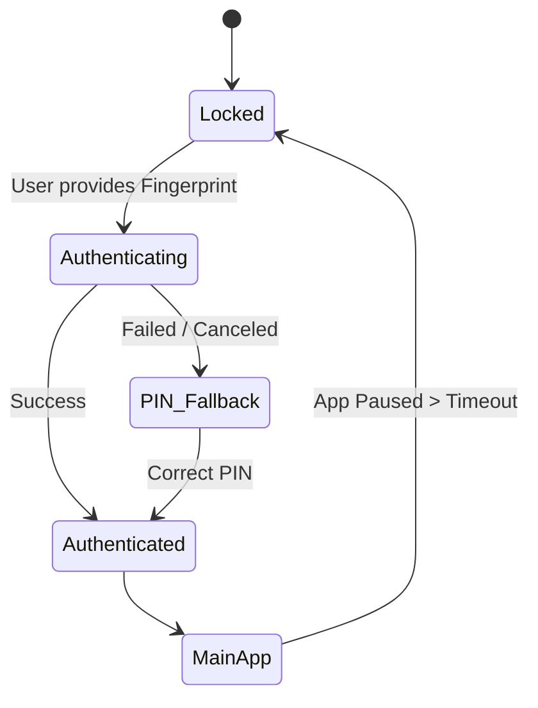
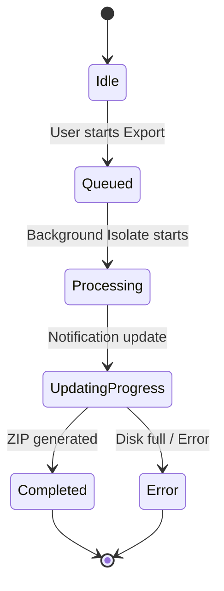

# 03 State Management - PasswordPDF

## Table of Contents
1. [Overview](#overview)
2. [Core Providers](#core-providers)
3. [State Flow (UI -> Logic -> UI)](#state-flow)
4. [State Diagrams](#state-diagrams)

---

## Overview
The app primarily uses the **Provider** package for state management. It follows a centralized approach where Services (which extend `ChangeNotifier`) are injected at the root of the app and consumed by widgets.

## Core Providers

| Provider Name | File Path | States Managed |
|---------------|-----------|----------------|
| **SettingsService** | `lib/features/settings/services/settings_service.dart` | Theme, Auth Method, Font Scale, Accent Color, Export Path. |
| **DocumentService** | `lib/services/document_service.dart` | Global list of `DocumentItem` (in-memory cache of SQLite data). |
| **ExportQueueService**| `lib/services/export_queue_service.dart` | Active ZIP export jobs, progress percentages, completion status. |
| **UpdateService** | `lib/features/update/services/update_service.dart` | Update availability, download progress. |

## State Flow

### Typical Flow: File Import
1. **Trigger**: User selects a file in `FileSystemBrowser`.
2. **Action**: The UI calls `DocumentService.addReference(path)`.
3. **Logic**: `DocumentService` checks for duplicates in SQLite, saves the path, and adds the new `DocumentItem` to its internal `List<DocumentItem>`.
4. **Notification**: `DocumentService` calls `notifyListeners()`.
5. **Update**: The `Consumer` in `DocumentDashboardScreen` rebuilds and shows the new file.

## State Diagrams

### Biometric Lock Flow

### Export Queue Flow

