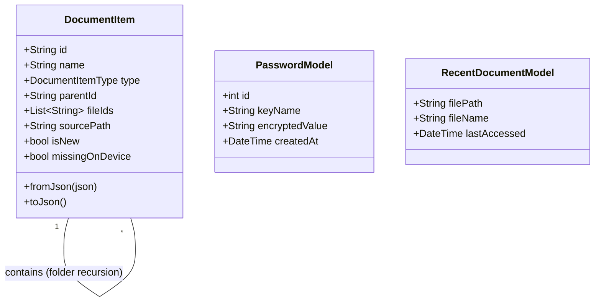

# 04 Data Models - PasswordPDF

## Table of Contents
1. [Overview](#overview)
2. [DocumentItem Model](#documentitem-model)
3. [PasswordModel](#passwordmodel)
4. [RecentDocumentModel](#recentdocumentmodel)
5. [Class Diagram](#class-diagram)

---

## Overview
PasswordPDF uses a combination of JSON serialization (for `DocumentItem` in `SharedPreferences`) and standard field mapping (for SQLite models). All models include `fromJson` and `toJson` methods.

## DocumentItem Model
**File Path**: `lib/models/document_item_model.dart`  
*Represents both Files and Folders in the hierarchy.*

| Field | Type | Purpose |
|-------|------|---------|
| `id` | `String` | Unique identifier (timestamp-based). |
| `name` | `String` | Display name of the file or folder. |
| `type` | `DocumentItemType`| Enum: `file` or `folder`. |
| `parentId` | `String?` | ID of the parent folder (null for root). |
| `fileIds` | `List<String>` | (Folders only) IDs of children files. |
| `sourcePath` | `String?` | (Files/Synced Folders) Absolute path on disk. |
| `size` | `int` | File size in bytes. |
| `createdAt` | `DateTime?` | File metadata: Created date. |
| `modifiedAt` | `DateTime?` | File metadata: Last modified. |
| `addedAt` | `DateTime?` | Date when file was added to the app. |
| `isNew` | `bool` | Badge indicator for unviewed items. |
| `missingOnDevice`| `bool` | Indicator for files moved or deleted outside the app. |
| `isImportedFile`| `bool` | Distinguishes manually added files from synced ones. |

---

## PasswordModel
**File Path**: `lib/models/password_model.dart`  
*Stores encrypted PDF passwords.*

| Field | Type | Purpose |
|-------|------|---------|
| `id` | `int?` | SQLite auto-increment ID. |
| `keyName` | `String` | Friendly name for the password (e.g. "Work PDF"). |
| `encryptedValue`| `String` | The XOR-encrypted password string. |
| `createdAt` | `DateTime` | Date added. |

---

## RecentDocumentModel
**File Path**: `lib/models/recent_document_model.dart`  
*Tracks the most recently accessed files.*

| Field | Type | Purpose |
|-------|------|---------|
| `filePath` | `String` | Path to the file. |
| `fileName` | `String` | Name for display. |
| `fileSize` | `int` | Size for display. |
| `lastAccessed` | `DateTime` | Timestamp for sorting. |

---

## Class Diagram

