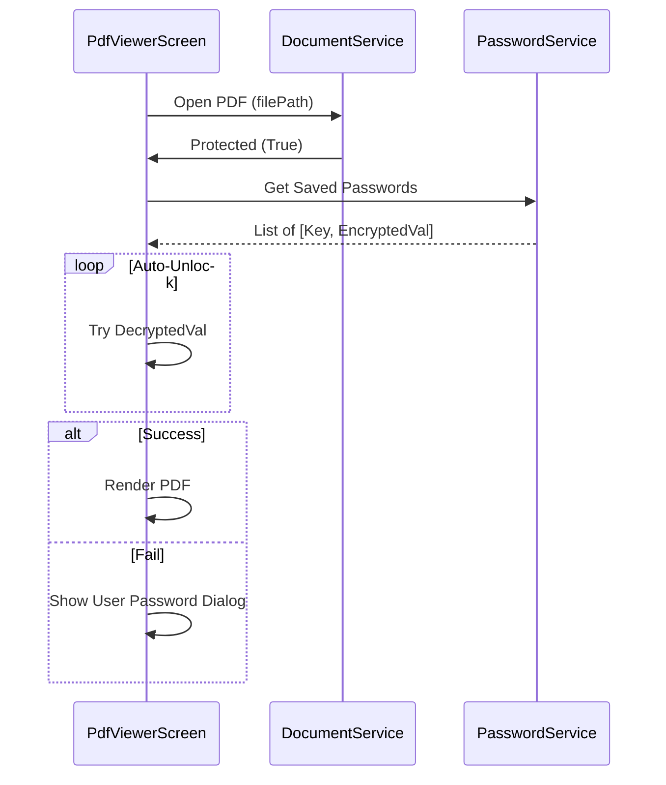
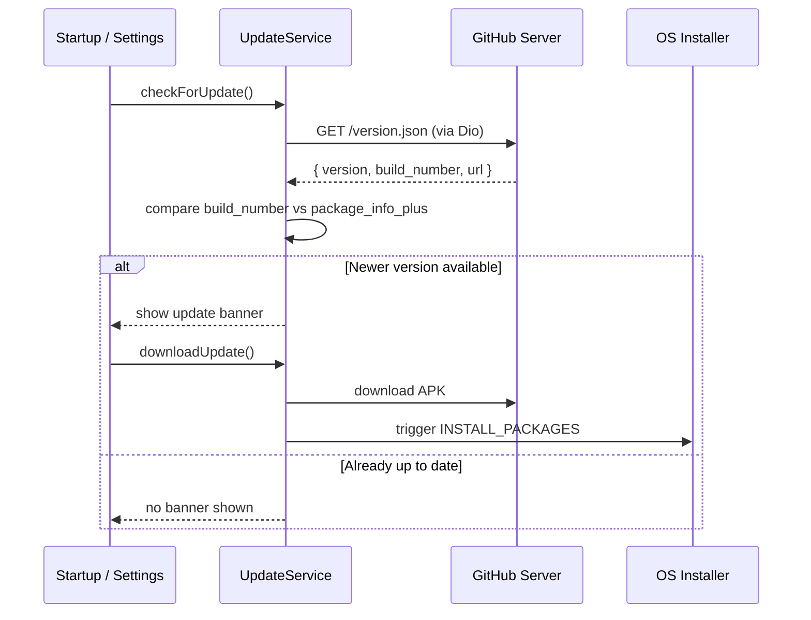
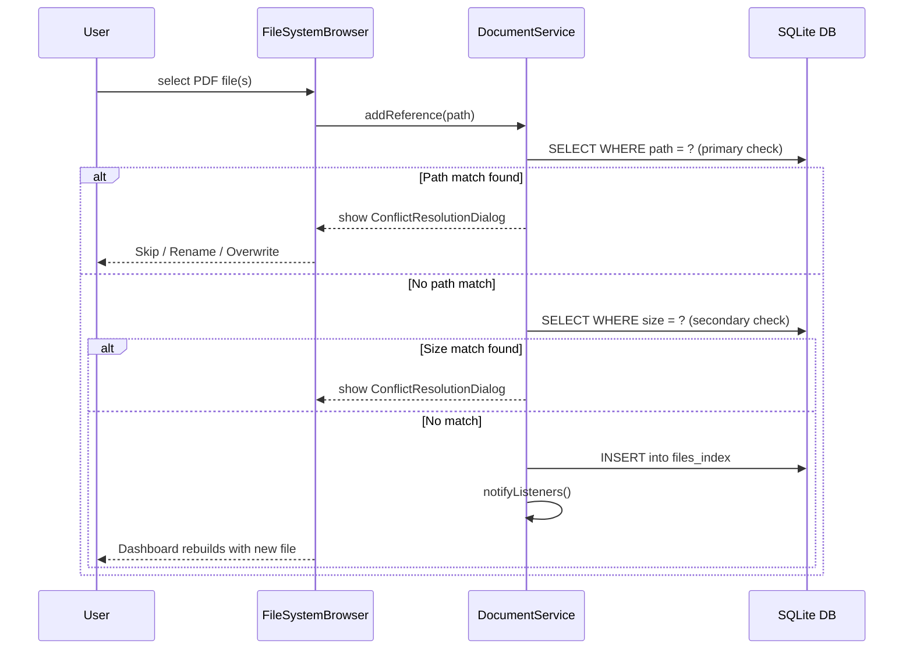

# 05 API & Services - PasswordPDF

## Table of Contents
1. [Overview](#overview)
2. [Local Services](#local-services)
3. [Update API](#update-api)
4. [Error Handling Strategy](#error-handling-strategy)
5. [Key Logic Flows](#key-logic-flows)

---

## Overview
PasswordPDF is a **locally focused app** and does not interact with a primary backend API for user data. However, it uses several services for background processing, security, and update checks.

## Local Services

| Service Name | File Path | Methods & Purpose |
|--------------|-----------|-------------------|
| **DocumentService** | `lib/services/document_service.dart` | `addReference()`: Add file path to DB. `syncFolder()`: Scan disk for changes. `createFolder()`: Virtual folder management. |
| **EncryptionService**| `lib/services/encryption_service.dart`| `encrypt()`: XOR encryption for passwords. `isKeySet()`: Check if master key exists. |
| **ExportQueueService**| `lib/services/export_queue_service.dart`| `enqueueExport()`: Start background ZIP task. `showImportNotification()`: Progress alerts. |
| **UpdateService** | `lib/features/update/services/update_service.dart` | `checkForUpdate()`: Check GitHub for new releases. `downloadUpdate()`: Download APK via Dio. |
| **LoggingService** | `lib/services/logging_service.dart` | `info()`, `error()`: Write logs to SQLite with rotation. |
| **PermissionService**| `lib/services/permission_service.dart`| `requestStoragePermission()`: Access device PDFs. `requestBiometricPermission()`: Hardware auth access. |
| **BiometricService** | `lib/services/biometric_service.dart` | `canCheckBiometrics()`: Hardware check. `authenticate()`: Trigger OS biometric prompt. |

## Update API (GitHub)
The app checks for updates by fetching metadata from a release JSON file hosted on GitHub.
- **Base URL**: Configured in `UpdateService` (GitHub Releases).
- **Security**: None (Publicly accessible JSON).
- **Request**: `GET /version.json`
- **Response**: `{ "version": "1.1.0", "build_number": 105, "url": "..." }`

## Error Handling Strategy
- **Service Layer**: Most methods return `Result` objects or throw specific exceptions caught by the UI.
- **Global Catch**: `main.dart` uses `runZonedGuarded` to catch unhandled async errors.
- **Reporting**: Errors are logged to the `logs` table in SQLite via `LoggingService`.

## Key Logic Flows

### DIAGRAM 1: PDF Password Unlock

### DIAGRAM 2: GitHub Update Check Flow

### DIAGRAM 3: File Import + Duplicate Detection

