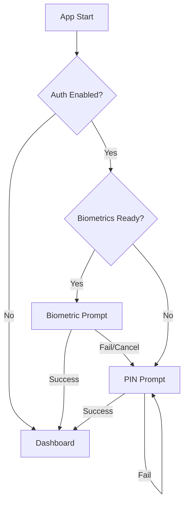

# 07 Authentication Flow - PasswordPDF

## Table of Contents
1. [Auth Methods](#auth-methods)
2. [Flow Architecture](#flow-architecture)
3. [Session Management](#session-management)
4. [Master PIN](#master-pin)

---

## Auth Methods
PasswordPDF supports dual-layer authentication:
1. **Biometric**: Fingerprint or FaceID via `local_auth`.
2. **PIN**: A user-defined numeric code as a primary or fallback method.

## Flow Architecture

### Startup Authentication
1. **Entry**: App launches into `AppEntry`.
2. **Check**: `SettingsService` checks if `authMethod` is set (PIN, Biometric, or Both).
3. **Lock**: If enabled, `BiometricLockScreen` is pushed and blocks the UI.
4. **Auth**: User provides Biometrics. If successful, `onAuthenticated` callback fires, updating the `_isAuthenticated` state.
5. **Fallback**: If Biometrics fail or are unavailable, the app prompts for the PIN via `PinEntryScreen`.

### Flowchart

## Session Management
- **Persistence**: Authentication state is **not** persisted across app restarts (Memory only).
- **Background Timeout**: The app tracks `backgroundTime` in `WidgetsBindingObserver`.
- **Auto-Lock**: If the app stays in the background for more than the `autoLockTimeout` (default 10m), it re-presents the `BiometricLockScreen` upon resuming.

## Master PIN
- **Security**: The PIN is stored in `FlutterSecureStorage` using Android's Keystore or iOS's Keychain.
- **Verification**: PIN verification happens in-memory; the app compares the hash of the input against the stored value via `SettingsService.verifyPin()`.
