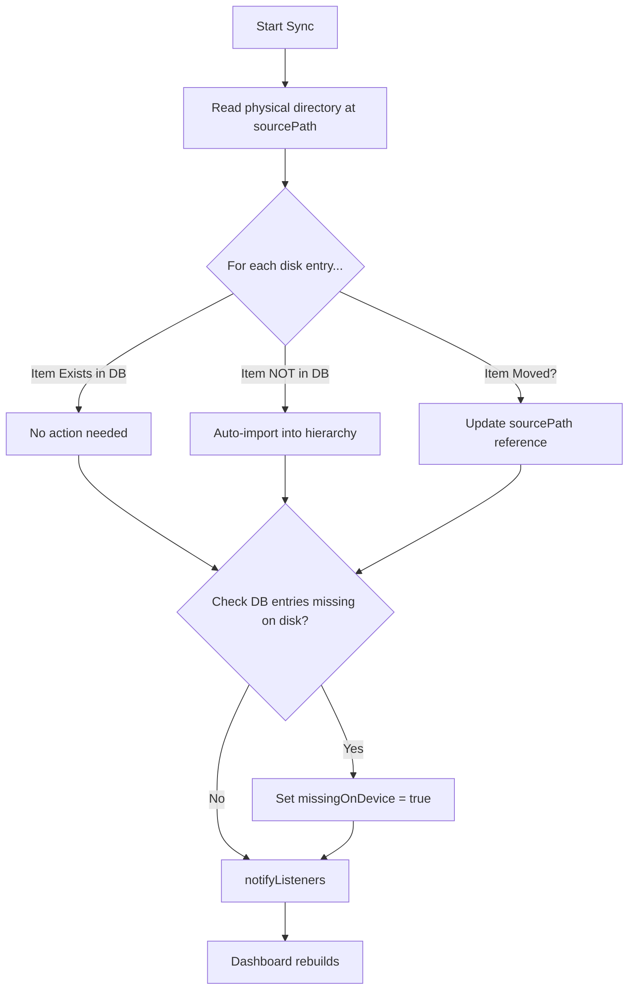
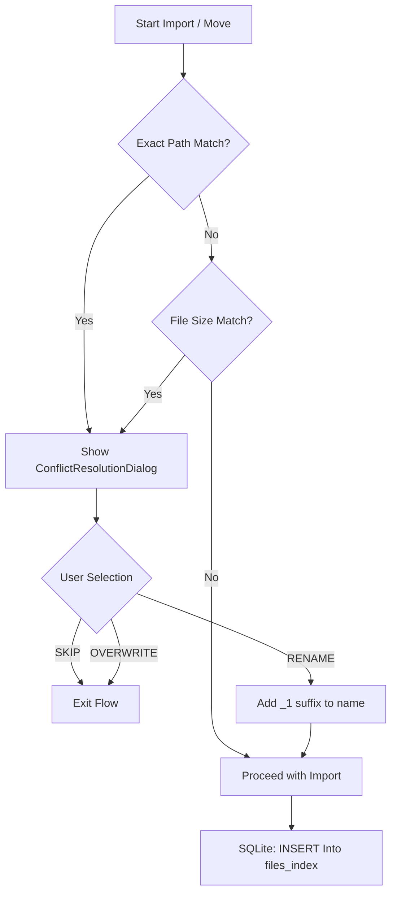

# 08 Business Logic - PasswordPDF

## Table of Contents
1. [Core Business Rules](#core-business-rules)
2. [Folder Synchronization Sync](#folder-synchronization)
3. [Duplicate Detection](#duplicate-detection)
4. [PDF Operation Rules](#pdf-operation-rules)

---

## Core Business Rules
- **Non-Destructive Management**: The app never deletes the original PDF from the device without explicit user confirmation.
- **Folder Integrity**: Virtual folders in the "Documents" tab can reference files from anywhere on the device.
- **Unique Passwords**: Passwords in the vault must have unique `keyName` labels.

## Folder Synchronization
The `syncFolder(folderId)` logic in `DocumentService` is the most complex business rule:
1. **Scan**: Reads physical directory entries at the folder's `sourcePath`.
2. **Compare**: Matches disk entries against the SQLite `files_index`. 
3. **Reconcile**:
   - **Missing on Disk**: Marks DB item as `missingOnDevice = true`.
   - **New on Disk**: Automatically imports the file/subfolder into the app's hierarchy.
   - **Moved**: Detects if a file was moved to a manual folder and ensures its reference is maintained.

## Duplicate Detection
Triggered during **Add Files**, **Move**, and **Import** operations:
- **Primary Check**: Matches by **Path** (Instant).
- **Secondary Check**: Matches by **File Size** in bytes (High Accuracy).
- **Conflict Resolution**: User is presented with a Choice:
  - **Skip**: Do not import.
  - **Rename**: Import with a suffix (e.g., `filename_1.pdf`).
  - **Overwrite**: (Not applicable in Zero Copy, acts as "Skip" since path is identical).

## PDF Operation Rules
Managed by `PdfToolsService` and `SfPdfViewer`:
- **Split**: Creates a new PDF file in the user's `exportPath`.
- **Merge**: Handles page orientations to ensure the merged file doesn't have warped layouts.
- **ZIP Export**: Recursively crawls the virtual folder tree and adds all referenced files into a single archive, optionally encrypted with a custom ZIP password.

## Logic Flow Diagrams

### Folder Sync Reconciliation (syncFolder)

### Duplicate Detection Decision Tree

