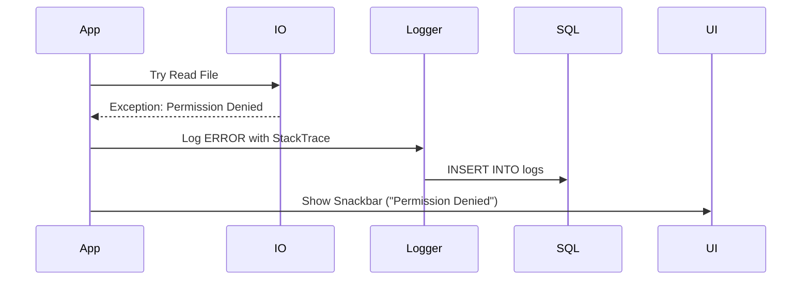

# 13 Error Handling - PasswordPDF

## Table of Contents
1. [Overview](#overview)
2. [Global Error Catcher](#global-error-catcher)
3. [Logging Service](#logging-service)
4. [User-Facing Errors](#user-facing-errors)

---

## Overview
Error handling in PasswordPDF is structured to ensure stability and provide developers with detailed logs should a crash occur.

## Global Error Catcher
Implemented in `main.dart` using:
1. **`FlutterError.onError`**: Catches UI/Layout errors and dumps them to the logs.
2. **`runZonedGuarded`**: Catches all asynchronous errors (API timeouts, File I/O failures) and persists them to SQLite.

## Logging Service
**File Path**: `lib/services/logging_service.dart`  
*A custom implementation that persists logs to a dedicated SQLite table.*

- **Levels**: INFO, DEBUG, WARN, ERROR.
- **Retention**: Old logs are automatically pruned when the count exceeds the limit (default 8000 entries).
- **Export**: Users can export the logs to an Excel file (`Developer Tools -> Export Logs`) for debugging assistance.

## User-Facing Errors
- **Snackbars**: Used for non-blocking errors (e.g., "File already exists", "Failed to copy").
- **Dialogs**: Used for blocking errors (e.g., "Corrupt PDF", "Invalid Password").
- **Safety**: The app uses `try-catch` blocks around all File I/O and PDF manipulation code to prevent UI freezes.

