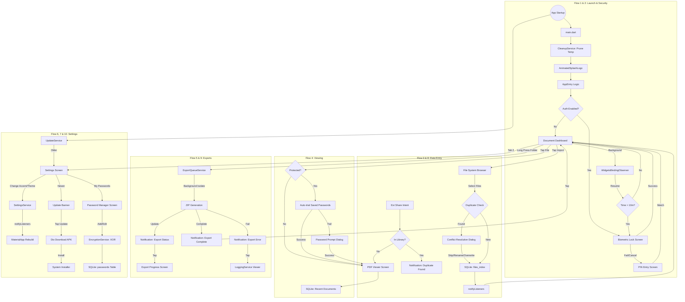

# 15 Project Flow Master - PasswordPDF

## Table of Contents
1. [Flow 1: App Launch & Auth](#flow-1--app-launch--auth)
2. [Flow 2: Auto-Lock](#flow-2--auto-lock)
3. [Flow 3: File Import](#flow-3--file-import)
4. [Flow 4: File Viewing (with password)](#flow-4--file-viewing-with-password)
5. [Flow 5: ZIP Export](#flow-5--zip-export)
6. [Flow 6: Settings & Theme Change](#flow-6--settings--theme-change)
7. [Flow 7: In-App Update](#flow-7--in-app-update)
8. [Flow 8: External Sharing Intent](#flow-8--external-sharing-intent)
9. [Flow 9: Notification Deep Links](#flow-9--notification-deep-links)
10. [Flow 10: Password Vault Management](#flow-10--password-vault-management)
11. [Master Project Flowchart](#master-project-flowchart)

---

## Flow 1: App Launch & Auth
The app entry point is `main.dart`, where `MultiProvider` injects all global services. Immediately after, `CleanupService.runCleanup()` is executed to prune any orphan temporary files. The user is presented with the `AnimatedSplashLogo` while `AppEntry` checks the `authMethod` in `SettingsService`.
- **No Auth**: Directly navigates to `MainScreen`.
- **Auth Enabled**: Pushes `BiometricLockScreen`.
  - **Success**: Navigates to `MainScreen`.
  - **Fail/Cancel**: Redirects to `PinEntryScreen`, which allows entry upon a correct PIN match.

## Flow 2: Auto-Lock
The app monitors its lifecycle state. When it moves to the background, `WidgetsBindingObserver` records the `backgroundTime`.
- **On Resume**: The app calculates the elapsed time.
- **Threshold**: If `elapsedTime > autoLockTimeout` (default 10 minutes), it re-presents the `BiometricLockScreen`.
- **Outcome**: The user must re-authenticate to return to their session on the `MainScreen`.

## Flow 3: File Import
Starting from the **Document Dashboard**, the user taps the **Import** button, launching the `FileSystemBrowser`.
1. **Selection**: User selects one or more PDF files.
2. **Duplicate Check**: `DocumentService` performs a two-stage check (first by file path, then by file size).
3. **Conflict**: If a duplicate is found, the `ConflictResolutionDialog` appears with options to **Skip**, **Rename**, or **Overwrite**.
4. **Success**: `addReference()` performs the SQLite insert, calls `notifyListeners()`, and the Dashboard rebuilds with the new file reference.

## Flow 4: File Viewing (with password)
When a user taps a file in the library:
1. **Protection Check**: `DocumentService.checkProtection(path)` determines if the PDF is encrypted.
2. **Not Protected**: Opens `PdfViewerScreen` immediately.
3. **Protected**: `PasswordService.getSavedPasswords()` retrieves the vault entries. The app auto-tries each XOR-decrypted value.
4. **Manual Entry**: If auto-trying fails, the `PasswordPromptDialog` is shown for manual entry or vault selection.
5. **Entry**: Upon correct password entry, the PDF is rendered, and an entry is saved to the `RecentDocuments` table.

## Flow 5: ZIP Export
Long-pressing a folder in the Dashboard triggers the **Export as ZIP** action via `ExportQueueService.enqueueExport(folderId)`.
1. **Isolate**: A background Isolate starts to avoid UI jank.
2. **Crawl**: The service recursively crawls the virtual folder tree in SQLite.
3. **Archive**: Referenced PDFs are added to a ZIP archive (with optional encryption).
4. **Update**: `flutter_local_notifications` provide live progress updates.
5. **Completion**: Tapping the "Export Complete" notification navigates to the `ExportProgressScreen` or opens the destination folder. Errors (like disk full) link to the `LoggingService` viewer.

## Flow 6: Settings & Theme Change
Inside the **Settings Tab**, users can modify the app's appearance.
1. **Action**: User changes the accent color or toggles dark/light mode.
2. **Persistence**: `SettingsService` updates the corresponding value and saves it to `SharedPreferences`.
3. **Rebuild**: `notifyListeners()` is called, and the `Consumer<SettingsService>` in `MyApp` rebuilds the `MaterialApp` with the newly generated `ColorScheme`.

## Flow 7: In-App Update
On app startup, `UpdateService.checkForUpdate()` is invoked.
1. **Request**: Fetches `version.json` from the GitHub release repository via `Dio`.
2. **Comparison**: Compares the remote `build_number` against the local build from `package_info_plus`.
3. **Prompt**: If a newer version is found, an update banner appears in the **Settings** screen.
4. **Execution**: Tapping "Update" downloads the APK. The app requests `INSTALL_PACKAGES` permission and launches the system installer.

## Flow 8: External Sharing Intent
When a user interacts with a PDF in an external app (like Email or WhatsApp):
1. **Discovery**: User selects **PasswordPDF** from the system share sheet.
2. **Capture**: `receive_sharing_intent` in `main.dart` captures the file path.
3. **Routing**:
   - **Exists**: If the file is already in the library, a "Duplicate Found" notification is shown.
   - **New**: If not present, the app auto-navigates to the `PdfViewerScreen`.

## Flow 9: Notification Deep Links
Notifications contain payloads that trigger specific app behaviors on tap:
- **Export Status**: Navigates to `ExportProgressScreen` using the `jobId` payload.
- **Export Complete**: Switches to the **Documents** tab and opens the destination folder.
- **Export Error**: Navigates to the `Developer Logs` via `LoggingService`.
- **Duplicate Found**: Triggers the location selector bottom sheet on the current screen.

## Flow 10: Password Vault Management
Accessed via **Settings -> My Passwords -> PasswordManagerScreen**.
- **Add**: User enters a label and password. `EncryptionService.encrypt()` applies XOR masking before the SQLite insert.
- **Application**: These passwords are auto-tried whenever a protected PDF is opened.
- **Edit/Delete**: Standard CRUD operations on the `passwords` table; edits require decryption before display and re-encryption on save.

---

## Master Project Flowchart

